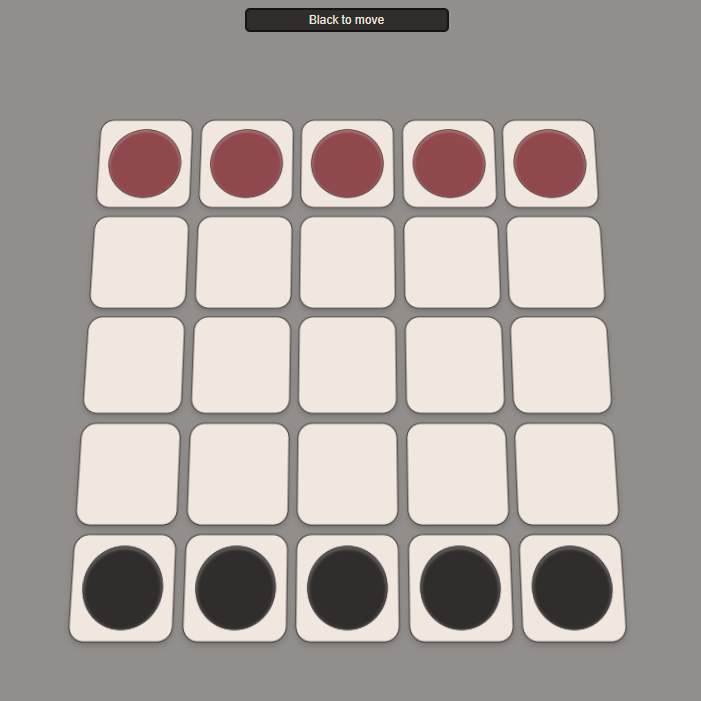
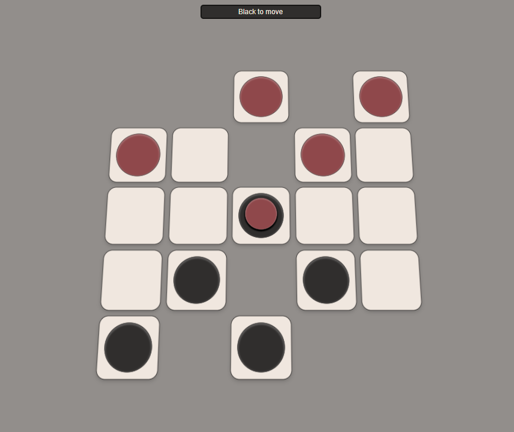
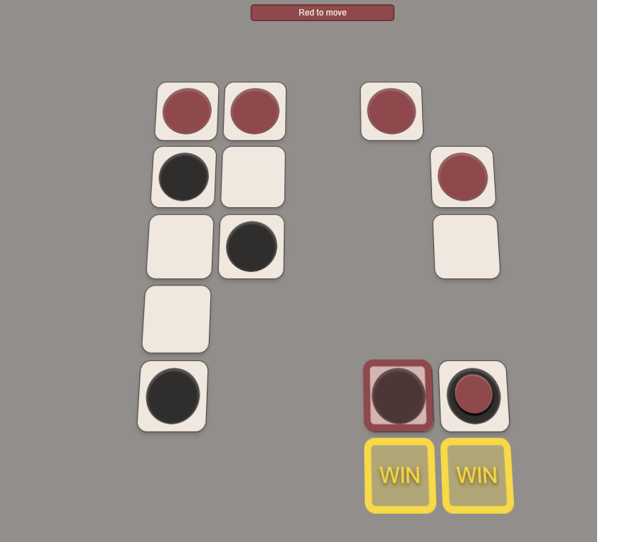

### Description:
Web-based `Passo` implementation, for fun. Pass-and-play. Not meant for actual deployment or real usage, but it works.

### Running
Run `gulp dev` to  begin compiling and minifying the SCSS+TS and then visit `index.html`

### Screenshots:

